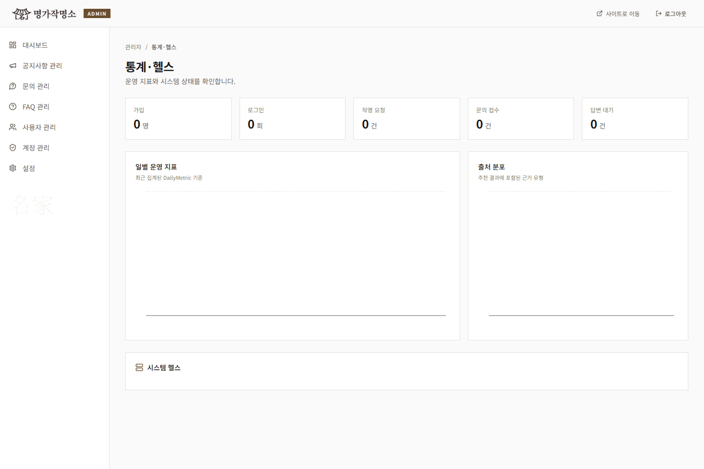
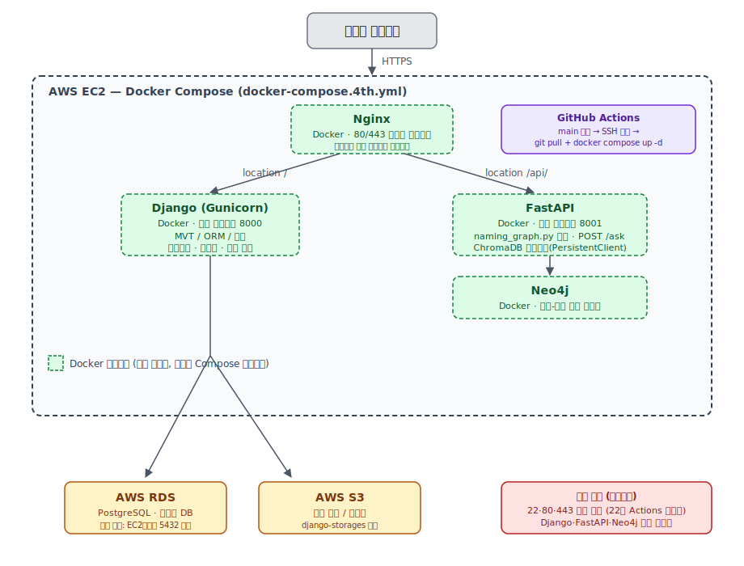

# SKN29-4th-4Team — 명가작명소

> SK네트웍스 Family AI 캠프 29기 4차 프로젝트  
> 3차 프로젝트에서 구축한 작명 QA 엔진을 기반으로, 실제 사용자가 이름을 추천받고 관리자가 서비스를 운영할 수 있는 AI 웹 애플리케이션으로 확장한 프로젝트입니다.

<p align="center">
  
</p>

---

## 목차

- [서비스 주소](#서비스-주소)
- [프로젝트 소개](#프로젝트-소개)
- [팀 소개](#팀-소개)
- [서비스 흐름](#서비스-흐름)
- [주요 기능](#주요-기능)
- [화면 구성](#화면-구성)
- [기술 스택](#기술-스택)
- [시스템 아키텍처](#시스템-아키텍처)
- [3차 산출물 활용](#3차-산출물-활용)
- [산출물](#산출물)
- [핵심 API](#핵심-api)
- [디렉토리 구조](#디렉토리-구조)
- [실행 방법](#실행-방법)

---

## 서비스 주소

| 구분 | 주소 | 비고 |
|---|---|---|
| 운영 홈페이지 | https://myeongga.site/ | 사용자용 웹 서비스 |
| 관리자 화면 | https://myeongga.site/manage/ | 관리자 계정 필요 |
| Django Admin | https://myeongga.site/admin/ | Django 기본 관리자 |
| AI 서버 상태 | https://myeongga.site/naming-api/health | FastAPI 헬스 체크 |

> `myeongga.site`는 Nginx 운영 설정과 HTTPS 인증서 경로에 반영되어 있으며, `/api/`는 Django, `/naming-api/`는 FastAPI로 프록시됩니다.

---

## 프로젝트 소개

**명가작명소**는 사용자가 성씨, 성별, 선호 오행, 희망 의미, 이름 유형을 입력하면 AI가 조건에 맞는 이름 후보와 추천 근거를 제공하는 작명 서비스입니다.

이 프로젝트는 3차 프로젝트의 결과물을 그대로 이어받아 발전시켰습니다. 3차에서는 LangGraph 기반 작명 QA 파이프라인, ChromaDB RAG 검색, Neo4j 한자-오행 그래프, 법령/어휘 검증 도구를 구축했습니다. 4차에서는 이 엔진을 FastAPI 서버로 감싸고, React 사용자 화면과 Django 기반 인증/관리 기능을 붙여 웹 서비스 형태로 구현했습니다.

| 항목 | 내용 |
|---|---|
| 프로젝트 주제 | 기존 AI 산출물을 활용한 LLM 연동 웹 애플리케이션 개발 |
| 서비스명 | 명가작명소 |
| 도메인 | 작명, 인명용 한자, 오행, 81수리, 법령 근거 |
| 핵심 목표 | 3차 작명 QA 엔진을 사용자용 웹 서비스와 관리자 운영 도구로 제품화 |
| 주요 기술 | React, Django, FastAPI, LangGraph, ChromaDB, Neo4j, Docker, Nginx |

---

## 팀 소개

3차와 4차 프로젝트는 같은 팀원이 연속으로 진행했습니다. 3차에서 데이터와 AI 파이프라인을 만들고, 4차에서 이를 웹 서비스로 확장하는 방식으로 역할을 이어갔습니다.

<table width="100%">
  <thead>
    <tr>
      <th width="12%" style="text-align: center; vertical-align: middle;">구분</th>
      <th width="22%" style="text-align: center; vertical-align: middle;">임준</th>
      <th width="22%" style="text-align: center; vertical-align: middle;">최지용</th>
      <th width="22%" style="text-align: center; vertical-align: middle;">윤대성</th>
      <th width="22%" style="text-align: center; vertical-align: middle;">이지현</th>
    </tr>
  </thead>
  <tbody>
    <tr>
      <td align="center"><b>캐릭터</b></td>
      <td align="center" style="text-align: center; vertical-align: middle;">
        
      </td>
      <td align="center" style="text-align: center; vertical-align: middle;">
        
      </td>
      <td align="center" style="text-align: center; vertical-align: middle;">
        
      </td>
      <td align="center" style="text-align: center; vertical-align: middle;">
        
      </td>
    </tr>
    <tr>
      <td align="center"><b>3차 기여</b></td>
      <td>Git 브랜치 관리<br/>서버 인프라 관리<br/>일정 조율</td>
      <td>Neo4j 스키마 설계<br/>한자-오행 관계 인덱싱<br/>그래프 도구 구현</td>
      <td>Unihan 파싱<br/>오행표 병합<br/>논문 PDF 전처리<br/>ChromaDB 인덱싱</td>
      <td>한자·어휘 데이터 검증<br/>임베딩 흐름 정리<br/>RAG 기반 QA 설계</td>
    </tr>
    <tr>
      <td align="center"><b>4차 기여</b></td>
      <td>통합 관리<br/>배포 흐름 정리<br/>운영 환경 조율</td>
      <td>인증<br/>회원가입·로그인<br/>마이페이지<br/>사용자 API 연동</td>
      <td>작명 생성 흐름<br/>히스토리 저장<br/>AI 파이프라인 연동</td>
      <td>관리자 기능<br/>콘텐츠·고객센터<br/>문서화 및 검증</td>
    </tr>
  </tbody>
</table>

---

## 서비스 흐름

1. 사용자가 자연어 또는 입력 폼으로 작명 조건을 입력합니다.
2. React 화면이 `/naming-api/names/generate`로 작명 요청을 보냅니다.
3. FastAPI가 3차 프로젝트의 LangGraph 작명 QA 파이프라인을 호출합니다.
4. 파이프라인은 ChromaDB, Neo4j, 81수리 계산, 법령/어휘 검증 결과를 조합합니다.
5. 사용자는 추천 이름, 한자 정보, 수리 판단, 오행 정보, 출처 근거를 결과 카드로 확인합니다.
6. 로그인 사용자는 결과를 저장하고 마이페이지에서 작명 이력을 다시 볼 수 있습니다.
7. 관리자는 별도 관리자 화면에서 회원, 문의, 공지, FAQ, 운영 지표를 관리합니다.

---

## 주요 기능

### 사용자 기능

- 자연어 작명 요청: 예) "김씨 성에 木오행이고 밝은 뜻의 이름 추천해줘"
- 구조화 입력 폼: 성씨, 성별, 이름 유형, 오행, 획수, 희망 의미 입력
- AI 이름 추천: 한자 이름과 순우리말 이름 후보 제공
- 추천 근거 표시: 한자 뜻·음·획수·오행, 81수리, 법령 근거, 출처 라벨 제공
- 회원 기능: 회원가입, 로그인, 로그아웃, 세션 복원, 비밀번호 변경, 회원 탈퇴
- 마이페이지: 내 정보 수정, 작명 이력 조회, 문의 내역 확인
- 고객센터: 공지사항, FAQ, 1:1 문의 접수
- 인사이트: 이름 트렌드와 작명 관련 콘텐츠 제공

### 관리자 기능

- 관리자 전용 로그인과 사용자 세션 분리
- `SUPERADMIN`, `ADMIN`, `ANALYST` 역할 기반 권한 관리
- 회원 목록, 상세 정보, 가입 승인/거절, 상태 변경, 활동 이력 조회
- 공지사항, FAQ, 문의 답변 관리
- 가입, 로그인, 작명 요청, 문의 등 운영 지표 확인
- 관리자 작업 감사 로그와 관리자 계정 관리
- 서비스 점검 모드 관리

---

## 화면 구성

main 브랜치에 반영된 화면설계 산출물 중 서비스 흐름을 이해하는 데 필요한 대표 화면만 선별했습니다. 전체 화면 이미지는 [docs/assets/screen-design](docs/assets/screen-design)에서 확인할 수 있습니다.

### 사용자 화면

| 진입 화면 | 작명 입력 | 결과 확인 | 이력 조회 |
|---|---|---|---|
|  |  |  |  |

### 관리자 화면

| 대시보드 | 공지 관리 | 회원 관리 | 통계 |
|---|---|---|---|
|  |  |  |  |

---

## 기술 스택

| 영역 | 기술 | 역할 |
|---|---|---|
| Frontend | React 18, TypeScript, Vite | 사용자/관리자 SPA 구현 |
| UI | Tailwind CSS, Radix UI, lucide-react, Recharts | 반응형 UI, 공통 컴포넌트, 통계 시각화 |
| Client State | TanStack Query, React Hook Form, Zod | 서버 상태 관리, 폼 처리, 입력 검증 |
| Backend | Django 6, Django ORM, Django Auth | 인증, 회원, 마이페이지, 고객센터, 운영 데이터 관리 |
| Admin API | django-ninja | 관리자 API와 역할 기반 권한 처리 |
| AI API | FastAPI, Pydantic | 작명 생성 API, QA API, 응답 스키마 관리 |
| AI Pipeline | LangGraph, LangChain, OpenAI API | 3차 작명 QA 엔진 재사용 |
| Data | ChromaDB, Neo4j, PostgreSQL | RAG 검색, 한자-오행 그래프, 서비스 데이터 저장 |
| Infra | Docker Compose, Nginx, Gunicorn | 로컬/운영 컨테이너 구성, 정적 파일 서빙, 리버스 프록시 |
| Cloud | AWS EC2, RDS, S3, GitHub Actions | 운영 배포와 관리형 인프라 |

---

## 시스템 아키텍처

<p align="center">
  
</p>

```text
사용자 브라우저 (https://myeongga.site)
   |
   |  /, /manage/*
   v
Nginx (:80 -> :443, HTTPS 종료)
   |-- React 사용자 화면
   |-- React 관리자 화면 (admin.html 별도 빌드)
   |-- /naming-api/* 요청 제한: 5r/m
   |-- /api/admin/login 요청 제한: 10r/m
   |
   |  /api/*
   v
Django + Gunicorn
   |-- 인증 / 회원 / 마이페이지
   |-- 고객센터 / 공지 / FAQ
   |-- 관리자 API / 통계 / 감사 로그
   |
   v
PostgreSQL

Nginx
   |
   |  /naming-api/*
   v
FastAPI
   |
   v
LangGraph 작명 QA Pipeline
   |-- ChromaDB RAG 검색
   |-- Neo4j 한자-오행 그래프
   |-- 81수리 / 오행 계산
   |-- 법령 / 우리말샘 검증
   v
OpenAI GPT 답변 생성 및 구조화
```

### 라우팅 구조

| 경로 | 담당 | 설명 |
|---|---|---|
| `/` | React | 사용자용 웹 화면 |
| `/manage/` | React | 관리자용 SPA, `admin.html` 별도 빌드 |
| `/api/` | Django | 사용자 인증, 마이페이지, 고객센터, 인사이트 API |
| `/api/admin/` | Django Ninja | 관리자 운영 API |
| `/naming-api/` | FastAPI | AI 작명 생성, QA, 그래프 API. Nginx 기준 분당 5회 제한 |
| `/admin/` | Django | Django Admin |

---

## 3차 산출물 활용

4차 프로젝트의 핵심은 3차 산출물을 단순 참고가 아니라 실제 서비스 엔진으로 재사용했다는 점입니다.

| 3차 산출물 | 4차 활용 방식 |
|---|---|
| LangGraph 작명 QA 그래프 | FastAPI 작명 생성 API에서 직접 호출 |
| ChromaDB 검색 컬렉션 | 한자, 수리, 오행, 법령, 순우리말, 논문 근거 검색 |
| Neo4j 한자-오행 그래프 | 추천 한자와 오행 관계 탐색 |
| 81수리/오행 계산 도구 | 추천 이름의 조건 충족 여부 계산 |
| 법령/우리말샘 검증 도구 | 인명용 한자와 순우리말 이름의 근거 보강 |
| 데이터 전처리 결과물 | 웹 서비스에서 사용하는 구조화 데이터로 재사용 |

### 3차 기준 데이터

| 데이터 | 규모 | 설명 |
|---|---:|---|
| 한자 데이터 | 2,438건 | 한자 뜻·음·획수·자원오행·발음오행 |
| 81수리 데이터 | 81건 | 획수 합산별 길흉 풀이 |
| 오행 조합 데이터 | 125건 | 오행 상생/상극 조합 |
| 법령 데이터 | 248건 | 가족관계등록법, 인명용 한자 규정 |
| 순우리말 이름 | 301건 | 순우리말 이름 후보 |
| 작명 논문 데이터 | 264건 | 논문 본문과 통계표 청크 |

---

## 산출물

프로젝트 설명과 구현 근거를 확인할 수 있는 주요 문서입니다.

| 구분 | 산출물 | 위치 |
|---|---|---|
| 요구사항 | 요구사항 명세서 | [docs/SKN29_4th_4team_요구사항명세서.md](docs/SKN29_4th_4team_요구사항명세서.md) |
| 프로젝트 계획 | 프로젝트 계획서 | [docs/프로젝트_계획서.md](docs/프로젝트_계획서.md) |
| 화면 설계 | 화면설계서 | [docs/화면설계서_최종.md](docs/화면설계서_최종.md) |
| 화면 설계 | 화면 이미지 산출물 | [docs/assets/screen-design](docs/assets/screen-design) |
| 시스템 구조 | 시스템 구성도 문서 | [docs/시스템_구성도.md](docs/시스템_구성도.md) |
| 시스템 구조 | 시스템 아키텍처 이미지 | [docs/시스템_아키텍처.svg](docs/시스템_아키텍처.svg) |
| 백엔드 설계 | 백엔드 개발 계획서 | [docs/백엔드_개발_계획서.md](docs/백엔드_개발_계획서.md) |
| 관리자 기능 | 관리자 페이지 개발 계획서 | [docs/관리자페이지_개발_계획서_개정판.md](docs/관리자페이지_개발_계획서_개정판.md) |
| 통합 가이드 | 프론트-백엔드 통합 최종 가이드 | [docs/프론트-백엔드_통합_최종가이드.md](docs/프론트-백엔드_통합_최종가이드.md) |
| 배포 | EC2 배포 매뉴얼 | [docs/EC2_배포_매뉴얼.md](docs/EC2_배포_매뉴얼.md) |
| 팀 운영 | 팀원 작업분담 | [docs/팀원_작업분담.md](docs/팀원_작업분담.md) |
| 팀 운영 | 팀원 작업 매뉴얼 | [docs/팀원_작업_매뉴얼.md](docs/팀원_작업_매뉴얼.md) |
| AI 작명 전략 | 작명전략 점검 및 수정 | [docs/작명전략_점검_및_수정.md](docs/작명전략_점검_및_수정.md) |
| 평가 자료 | 평가계획서 PDF | [docs/SKN 29기_AI 활용 애플리케이션 개발_평가계획서.docx.pdf](<docs/SKN 29기_AI 활용 애플리케이션 개발_평가계획서.docx.pdf>) |

---

## 핵심 API

README에서는 전체 엔드포인트 대신 서비스 흐름을 이해하는 데 필요한 대표 API만 정리합니다. 상세 계약은 코드와 `docs/` 문서를 기준으로 확인합니다.

| 구분 | 대표 경로 | 설명 |
|---|---|---|
| 사용자 인증 | `/api/auth/*` | CSRF, 회원가입, 로그인, 로그아웃, 계정 찾기 |
| 마이페이지 | `/api/me`, `/api/me/history` | 내 정보, 비밀번호 변경, 작명 이력 조회/저장 |
| 고객센터 | `/api/support/*` | 문의, 공지사항, FAQ |
| 인사이트 | `/api/insights` | 이름 트렌드와 작명 콘텐츠 |
| 관리자 | `/api/admin/*` | 회원, 공지, FAQ, 문의, 대시보드, 감사 로그, 관리자 계정 |
| 작명 AI | `/naming-api/names/generate` | 조건 기반 이름 추천 |
| 작명 QA | `/naming-api/ask` | 자유 텍스트 작명 질의응답 |
| 그래프 | `/naming-api/graph/ohaeng` | 오행 상생/상극 관계 데이터 |

---

## 디렉토리 구조

```text
SKN29-4th-4Team/
├── .github/
│   └── workflows/             # GitHub Actions 배포 워크플로우
├── frontend/                  # React + Vite 사용자/관리자 SPA
│   ├── public/                # 정적 공개 리소스
│   └── src/
│       ├── api/               # API 어댑터
│       ├── app/               # 화면, 컴포넌트, 훅, provider, schema
│       ├── assets/            # 프론트 이미지/텍스처 리소스
│       └── styles/            # 전역 스타일
├── webapp/                    # Django 프로젝트
│   ├── config/                # 설정과 URL 라우팅
│   ├── naming/                # 인증, 회원, 관리자, 고객센터, 히스토리 앱
│   └── static/                # Django 정적 파일
├── fastapi_app/               # AI 작명 API 서버
├── src/
│   ├── graph/                 # LangGraph 작명 그래프, Neo4j 인덱싱
│   └── mcp/                   # RAG/DB/법령/그래프 도구
├── data/
│   ├── chroma/                # ChromaDB PersistentClient 저장소
│   ├── processed/             # 한자/성씨 등 전처리 결과
│   └── raw/                   # 원천 자료와 참조 데이터
├── deploy/                    # FastAPI/Nginx 배포 설정
├── docs/
│   ├── assets/
│   │   ├── screen-design/     # 사용자/관리자 화면설계 이미지
│   │   └── team/              # README 팀원 이미지
│   ├── SKN29_4th_4team_요구사항명세서.md
│   ├── 시스템_구성도.md
│   └── *.md                   # 계획서, 배포 매뉴얼, 작업 가이드
├── docker-compose.local.yml   # 로컬 개발용 Docker Compose
└── docker-compose.4th.yml     # 운영 배포용 Docker Compose
```

---

## 실행 방법

### 1. 저장소 클론

```bash
git clone https://github.com/Somber-7/SKN29-4th-4Team.git
cd SKN29-4th-4Team
```

### 2. 환경변수 준비

```bash
cp .env.local.example .env.local
```

`.env.local`에 OpenAI API 키, Django Secret Key, DB, Neo4j, 외부 API 값을 설정합니다. 로컬 개발용 DB/Neo4j 기본값은 예시 파일을 기준으로 사용할 수 있습니다.

### 3. 로컬 전체 스택 실행

```bash
docker compose --env-file .env.local -f docker-compose.local.yml up --build
```

최초 실행 후 별도 터미널에서 마이그레이션을 적용합니다.

```bash
docker compose --env-file .env.local -f docker-compose.local.yml exec django python manage.py migrate
```

### 4. Neo4j 데이터 적재

그래프 기반 한자·오행 조회를 테스트하려면 최초 1회 Neo4j 데이터를 적재합니다.

```bash
docker compose --env-file .env.local -f docker-compose.local.yml exec fastapi python src/graph/index_hanja_neo4j.py --check-connection
docker compose --env-file .env.local -f docker-compose.local.yml exec fastapi python src/graph/index_hanja_neo4j.py --execute
```

### 5. 접속 경로

| URL | 설명 |
|---|---|
| `http://localhost/` | 로컬 사용자 화면 |
| `http://localhost/manage/` | 로컬 관리자 화면 |
| `http://localhost/admin/` | 로컬 Django Admin |
| `https://myeongga.site/` | 운영 홈페이지 |

상태 확인:

```bash
curl http://localhost/api/auth/csrf
curl http://localhost/naming-api/health
curl https://myeongga.site/naming-api/health
```

---

## 프론트엔드 단독 개발

백엔드 Docker 스택을 실행한 상태에서 프론트엔드만 빠르게 개발할 수 있습니다.

```bash
cd frontend
npm install
npm run dev
```

관리자 화면 개발:

```bash
cd frontend
npm run dev:admin
```

---

## 배포 구조

운영 환경은 `docker-compose.4th.yml`을 기준으로 구성합니다.

```bash
docker compose -f docker-compose.4th.yml up --build -d
```

운영 구성은 다음과 같습니다.

| 구성요소 | 역할 |
|---|---|
| Nginx | `myeongga.site` 80/443 포트 공개, React 빌드 결과 서빙, API 리버스 프록시 |
| Django + Gunicorn | 인증, 회원, 관리자, 고객센터, 서비스 데이터 처리 |
| FastAPI | 3차 작명 QA 엔진을 호출하는 AI API 서버 |
| Neo4j | 한자-오행 그래프 저장소 |
| PostgreSQL | 운영 서비스 데이터 저장소, AWS RDS 사용 |
| S3 | 정적/미디어 파일 저장소 |
| GitHub Actions | main 병합 후 EC2 자동 배포 |

---

## 3차 대비 4차 확장 포인트

| 3차 프로젝트 | 4차 프로젝트 |
|---|---|
| Open WebUI 기반 QA 파이프라인 | 사용자가 직접 접근하는 React 웹 서비스 |
| 데이터와 AI 엔진 중심 | 인증, 히스토리, 고객센터, 관리자 운영 기능 포함 |
| 파이프라인 단위 실행 | 입력 폼, 결과 카드, 마이페이지 저장 흐름까지 연결 |
| RAG/그래프/법령 도구 구현 | FastAPI API로 감싸 웹에서 호출 가능하게 구성 |
| 로컬 파이프라인 실행 중심 | Docker, Nginx, RDS/S3, GitHub Actions 기반 배포 구조 |
