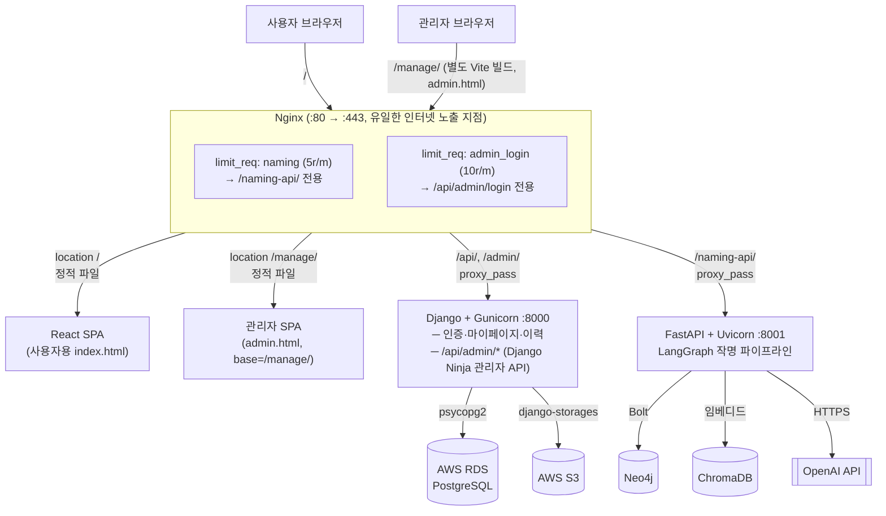
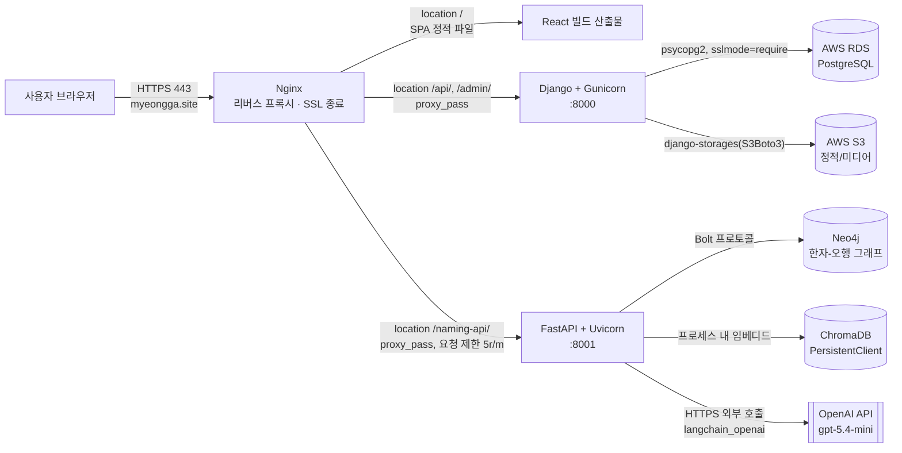
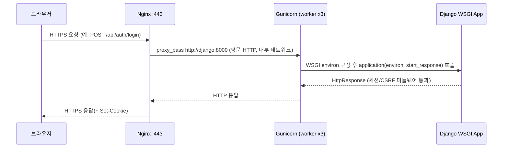
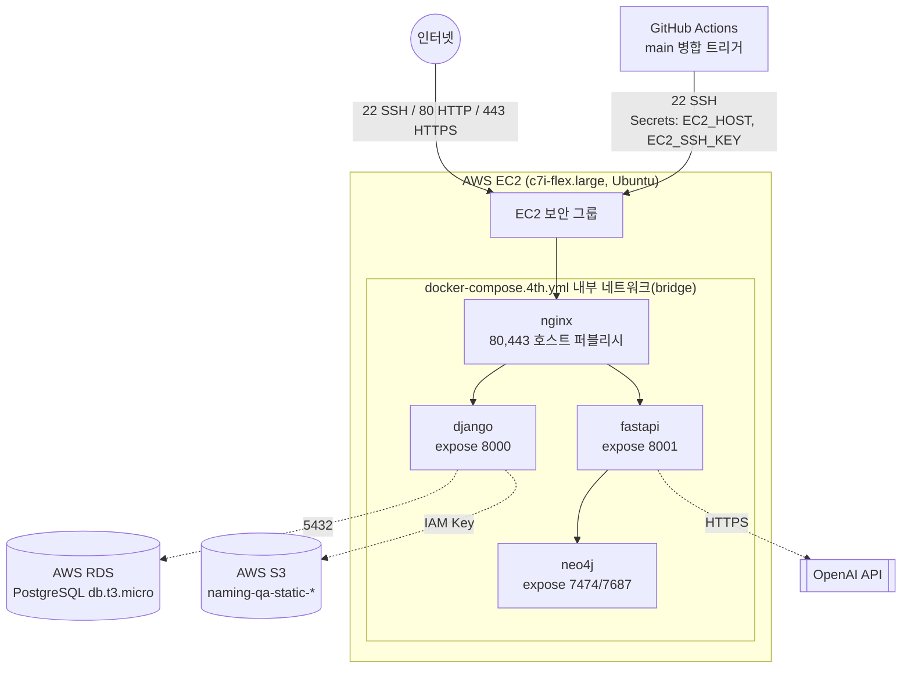
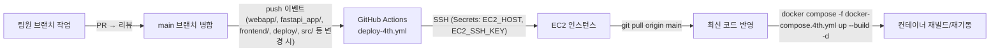

# SKN29 4차 프로젝트 시스템 구성도

## 1. 문서 개요

| 항목 | 내용 |
|---|---|
| 프로젝트명 | 명가작명소 — LLM 연동 AI 작명 서비스 웹 애플리케이션 |
| 문서명 | 시스템 구성도 |
| 작성일 | 2026-07-08 |
| 목적 | 평가계획서의 "시스템 구성도" 평가 항목(전체 데이터 흐름, 배포 아키텍처, 클라우드/컨테이너 구성, 보안/확장성)을 충족하는 근거 기반 구성도를 정리한다. |

### 1.1 전체 구성도

사용자용 서비스와 관리자용 서비스를 하나의 그림으로 합친 전체 구성도다. 이후 2~7장은 이 그림의 각 부분을 세부적으로 풀어서 설명한다.



| 사용자 축 | 관리자 축 |
|---|---|
| `/` → React SPA (사용자 화면) | `/manage/` → 관리자 SPA (별도 Vite 빌드, `admin.html`) |
| `/api/*` (auth, me, history, support 등) → Django | `/api/admin/*` (Django Ninja) → Django (같은 컨테이너, 별도 라우터) |
| `/naming-api/*` → FastAPI (분당 5회 제한) | `/api/admin/login` → Django (분당 10회 제한, 무차별 대입 방지) |

두 축은 같은 Nginx·Django·인프라를 공유하지만, **관리자 화면은 사용자 화면과 다른 빌드 산출물로 완전히 분리**되어 있고(§2), **관리자 로그인만 별도의 레이트리밋**이 걸려 있다(§6.2)는 점이 핵심 차이다.

---

## 2. 전체 시스템 개요

| 구성 요소 | 역할 | 실행 방식 | 포트 |
|---|---|---|---|
| React — 사용자 SPA (Vite 빌드) | 화면 라우팅, 반응형 UI, 입력/결과/마이페이지 화면 | Nginx 컨테이너에 정적 파일로 서빙(`/`, `index.html`) | - |
| React — 관리자 SPA (Vite `--mode admin` 빌드) | 회원·통계·공지/FAQ·문의 등 관리자 전용 화면. 사용자 SPA와 **별도 번들**(`admin.html`, `main.admin.tsx`)로 빌드되어 코드가 섞이지 않음 | Nginx 컨테이너에 정적 파일로 서빙(`/manage/`, `admin.html`) | - |
| Nginx | 리버스 프록시, HTTPS 종료, 정적 파일 서빙, 요청 경로 라우팅 | Docker 컨테이너, 유일하게 호스트에 포트 퍼블리시 | 80, 443 |
| Django (Gunicorn) | 세션 인증, 회원가입/로그인/로그아웃, 마이페이지, 작명 이력 CRUD, **관리자 API(`/api/admin/*`, Django Ninja, RBAC)** | Docker 컨테이너, Compose 내부 네트워크 전용 | 8000 |
| FastAPI (Uvicorn) | LangGraph 기반 작명 파이프라인 실행, 오행 그래프 조회 API | Docker 컨테이너, Compose 내부 네트워크 전용 | 8001 |
| Neo4j | 한자-오행 관계 그래프 저장/조회 | Docker 컨테이너, Compose 내부 네트워크 전용 | 7474, 7687 |
| ChromaDB | 한자·수리·오행·법령·순우리말 벡터 검색 인덱스 | FastAPI 컨테이너 내부 임베디드(`PersistentClient`), `./data` 볼륨 마운트 | - (프로세스 내장) |
| OpenAI API | 작명 라우팅/생성/검증용 LLM(`gpt-5.4-mini`) 호출 | FastAPI 컨테이너에서 `langchain_openai.ChatOpenAI`로 외부 HTTPS 호출 | 443(외부) |
| AWS RDS (PostgreSQL) | 사용자 계정, 약관 동의, 작명 이력 저장 | AWS 관리형 서비스(컨테이너화하지 않음) | 5432 |
| AWS S3 | Django 정적/미디어 파일 저장(`django-storages`) | AWS 관리형 서비스 | 443(HTTPS) |

Nginx만 인터넷에 노출되고, Django·FastAPI·Neo4j는 서비스명(`django`, `fastapi`, `neo4j`)으로만 서로 통신하는 Docker Compose 내부 네트워크에 위치한다. RDS/S3는 AWS 관리형 리소스라 별도 네트워크 경로(보안 그룹, IAM)로 접근한다.

---

## 3. 전체 데이터 흐름 (클라이언트 → 서버 → DB → 외부 LLM API)



### 3.1 핵심 요청 흐름 3가지

**① 로그인/인증 (FR-AUTH-002, IF-AUTH-002)**
```
브라우저 → Nginx(/api/auth/login) → Django(view) → RDS(User 조회) → Django(세션 생성) → Nginx → 브라우저(세션 쿠키)
```

**② 작명 생성 (FR-LLM-003, IF-LLM-002)**
```
브라우저 → Nginx(/naming-api/names/generate) → FastAPI
  → naming_graph.py(LangGraph StateGraph)
    → ChromaDB(임베디드, 문헌/한자 근거 검색)
    → Neo4j(오행 관계 조회, graph_server 경유)
    → OpenAI API(_llm_router → _llm_generate → _llm_verify 순 호출)
  → FastAPI(NameResult[] 응답) → Nginx → 브라우저(결과 카드 렌더링)
```

**③ 작명 이력 저장/조회 (FR-HIST-001~002, IF-HIST-001)**
```
브라우저 → Nginx(/api/me/history) → Django(view) → RDS(NamingHistory insert/select) → 브라우저
```

**④ 관리자 로그인/기능 (관리자 SPA `/manage/`)**
```
관리자 브라우저 → Nginx(/manage/) → 관리자 SPA(admin.html, 별도 번들) 서빙
관리자 브라우저 → Nginx(/api/admin/login, admin_login 레이트리밋 10r/m) → Django(admin_api, Django Ninja) → RDS(관리자 계정 조회) → 세션/토큰 발급
관리자 브라우저 → Nginx(/api/admin/*) → Django(admin_api, RBAC 검사) → RDS(회원/이력/공지/FAQ 등 CRUD) → 브라우저
```

---

## 4. 배포 아키텍처 — Nginx · Gunicorn · Django(WSGI) 연계 구조

Django는 WSGI 애플리케이션(`config.wsgi:application`)이며, 컨테이너 내부에서 Gunicorn이 이를 3개 워커 프로세스로 구동한다(`webapp/Dockerfile`). Nginx는 이 Gunicorn 앞단에서 리버스 프록시 역할만 수행하고, WSGI 프로토콜 자체를 처리하지 않는다 — TCP로 HTTP 요청을 그대로 Gunicorn에 전달하면 Gunicorn이 WSGI 콜러블로 변환해 Django에 넘긴다.



FastAPI는 WSGI가 아닌 ASGI 애플리케이션이므로 Gunicorn 대신 Uvicorn이 직접 구동한다(`deploy/Dockerfile.fastapi`의 `CMD ["uvicorn", "fastapi_app.main:app", ...]`). 즉 두 백엔드는 서로 다른 서버 프로세스 모델을 쓰며, Nginx가 경로(`/api/` vs `/naming-api/`)로 이를 구분해 프록시한다.

| 계층 | 구성 | 비고 |
|---|---|---|
| 프록시 | Nginx (`deploy/nginx/nginx.conf`) | `/` → React SPA, `/api/`·`/admin/` → Django, `/naming-api/` → FastAPI, `/static/` → collectstatic 볼륨 |
| WSGI 서버 | Gunicorn `--workers 3` | Django 동기 요청 처리, 워커 수로 동시 처리량 확장 |
| ASGI 서버 | Uvicorn (단일 프로세스) | FastAPI 비동기 요청 처리, LangGraph 호출 동안 이벤트 루프 유지 |
| 애플리케이션 | Django(WSGI) / FastAPI(ASGI) | 인증·이력 vs LLM 파이프라인으로 책임 분리(NFR-MAINT-001) |

---

## 5. 클라우드/컨테이너 구성 — AWS 리소스 × Docker 네트워크



### 5.1 Docker 컨테이너 목록 (운영, `docker-compose.4th.yml`)

| 컨테이너 | 이미지/빌드 | 호스트 포트 퍼블리시 | 내부 포트(expose) | 재시작 정책 |
|---|---|---|---|---|
| nginx | `deploy/nginx/Dockerfile` (멀티스테이지: React 빌드 + nginx:alpine) | 80, 443 | - | `unless-stopped` |
| django | `webapp/Dockerfile` (Gunicorn) | 없음 | 8000 | `unless-stopped` |
| fastapi | `deploy/Dockerfile.fastapi` (Uvicorn) | 없음 | 8001 | `unless-stopped` |
| neo4j | `neo4j:5` 공식 이미지 | 없음 | 7474, 7687 | `unless-stopped` |

`restart: unless-stopped`가 전 컨테이너에 적용되어 있어 EC2 인스턴스 재부팅이나 프로세스 비정상 종료 시에도 `docker compose up -d` 없이 자동 복구된다(NFR-DEP-001 배포 재현성과 연결).

### 5.2 AWS 관리형 리소스

| 리소스 | 사양 | 용도 |
|---|---|---|
| EC2 | `c7i-flex.large`, Ubuntu, 스토리지 30GiB 이상 | Docker Compose 실행 호스트(스토리지 30GiB는 FastAPI 이미지의 torch 설치 공간 확보용) |
| RDS | PostgreSQL, `db.t3.micro`, 프리 티어, DB명 `namingdb` | Django `User`/`UserConsent`/`NamingHistory` 저장 |
| S3 | 버킷 `naming-qa-static-*`, ACL 비활성화 + 버킷 정책으로 공개 읽기 | Django 정적/미디어 파일 서빙(`django-storages`) |
| IAM | 사용자 `naming-qa-s3-user`, 프로그래밍 방식 액세스 전용 | Django가 S3에 접근하기 위한 액세스 키 발급(콘솔 로그인 권한 없음 — 최소 권한 분리) |

### 5.3 로컬 개발 환경과의 차이 (`docker-compose.local.yml`)

| 항목 | 로컬 (`docker-compose.local.yml`) | 운영 (`docker-compose.4th.yml`) |
|---|---|---|
| PostgreSQL | `postgres:16` 컨테이너 직접 구동 (5432 호스트 퍼블리시) | AWS RDS 관리형 서비스 (컨테이너 없음) |
| Nginx | `Dockerfile.local`, HTTP(80)만 | `Dockerfile`, HTTP→HTTPS 리다이렉트 + Let's Encrypt SSL 종료 |
| TLS | 없음 | `/etc/letsencrypt` 볼륨 마운트, `myeongga.site` 인증서 |
| 정적 파일 | 로컬 볼륨(`static_volume`) | 운영도 동일 볼륨 사용하되 S3는 `USE_S3=true`일 때만 활성화(`settings.py`) |
| env 파일 | `.env.local` | `.env` |

---

## 6. 보안 및 확장성

### 6.1 네트워크 격리 (보안 그룹 / 컨테이너 노출 범위)

| 대상 | 인바운드 허용 | 근거 |
|---|---|---|
| EC2 보안 그룹 | 22(SSH), 80(HTTP), 443(HTTPS) — Django(8000)·FastAPI(8001)·Neo4j(7474/7687)는 인바운드 규칙 자체가 없음 | `docs/시스템_아키텍처.svg`, `EC2_배포_매뉴얼.md` Part A-0 |
| RDS 보안 그룹 | 5432 포트, 소스는 EC2 보안 그룹으로 한정(퍼블릭 액세스 비활성) | `EC2_배포_매뉴얼.md` Part A-4 |
| Docker Compose 내부 네트워크 | django/fastapi/neo4j는 `expose`만 선언되어 호스트에 포트가 열리지 않고, 서비스명으로만 상호 통신 | `docker-compose.4th.yml` |

즉 외부에서 직접 도달 가능한 지점은 Nginx(80/443)와 SSH(22) 뿐이며, 애플리케이션·DB·그래프 DB는 전부 Nginx 또는 EC2 보안 그룹 뒤에 격리되어 있다(CST-SEC-001과 대응).

### 6.2 애플리케이션 계층 보안

| 항목 | 설정 | 목적 |
|---|---|---|
| HTTPS 강제 | `nginx.conf`: 80 → 443 301 리다이렉트, Let's Encrypt 인증서 | 전송 구간 암호화 |
| CSRF 허용 출처 제한 | `CSRF_TRUSTED_ORIGINS`에 `localhost`, `localhost:5173`, `myeongga.site`만 등록(와일드카드 아님) | 임의 출처의 상태 변경 요청 차단 |
| CSRF 쿠키 정책 | `CSRF_COOKIE_HTTPONLY = False` | React SPA가 JS로 CSRF 토큰을 읽어 헤더에 실어 보내야 하므로 의도적으로 완화(대신 `SameSite=Lax`로 보완) |
| 세션 쿠키 | `SESSION_COOKIE_SAMESITE = 'Lax'` | 크로스 사이트 세션 전송 제한 |
| DB 연결 암호화 | RDS 연결 시 `DB_SSL_REQUIRE=true`면 `sslmode=require` | 로컬 컨테이너 DB는 미적용, 운영(RDS)에서만 강제 |
| IAM 최소 권한 | S3 전용 프로그래밍 액세스 사용자(콘솔 로그인 불가) | RDS/EC2 자격과 분리된 별도 자격 증명으로 권한 분리 |
| LLM API 요청 제한 | Nginx `limit_req_zone ... rate=5r/m` + `burst=5` (`/naming-api/`만 적용) | 외부 LLM 호출 비용 남용 방지(NFR-SEC-003) |
| 관리자 로그인 요청 제한 | Nginx `limit_req_zone ... zone=admin_login rate=10r/m` + `burst=5 nodelay` (`/api/admin/login`만 적용, 계정 잠금 5회/10분과 별도) | 관리자 계정 대상 무차별 대입(brute-force) 공격 완화 |

### 6.3 확장성 관점

| 계층 | 현재 구성 | 확장 여지 |
|---|---|---|
| Gunicorn(Django) | `--workers 3` 고정 | 워커 수 조정 또는 Docker Compose `deploy.replicas` + Nginx `upstream` 로드밸런싱으로 수평 확장 가능 |
| Uvicorn(FastAPI) | 단일 프로세스 | LLM 호출은 `async/await` 기반이라 단일 프로세스로도 동시 요청을 처리하나, CPU 바운드 부하 증가 시 `--workers` 옵션 추가 검토 필요 |
| Neo4j | 컨테이너 힙 1G/페이지캐시 512M로 고정 튜닝 | 데이터 규모 증가 시 EC2 스펙과 함께 상향 조정 |
| RDS | `db.t3.micro`(프리 티어) | 인스턴스 클래스 업그레이드로 수직 확장 가능(관리형이라 무중단 전환 지원) |
| Nginx 요청 제한 | 고정 5r/m | 사용자 등급별 차등 제한 등으로 세분화 가능(현재는 IP 단위 단일 정책) |

---

## 7. CI/CD 배포 흐름



`main` 브랜치에 지정된 경로(`webapp/**`, `fastapi_app/**`, `frontend/**`, `deploy/**`, `src/**`, `requirements-fastapi.txt`, `docker-compose.4th.yml`)가 변경되어 push될 때만 워크플로우가 실행되어, 배포와 무관한 변경(문서 등)으로 불필요한 재배포가 발생하지 않는다.

---

